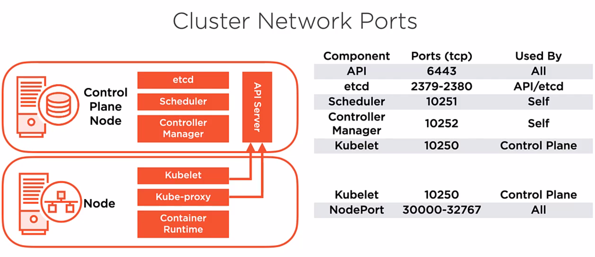

# Installing and Configuring Kubernetes

## Installation Considerations
What do I need to know and do to install kubernetes?

Where to install?
- Cloud
    - IaaS - Virtual Machines
        - install everything from scratch
        - take on more responsiblity administering the cluster
    - PaaS - Managed Service
        - Control Plane is managed for you
        - Not as flexible as IaaS offering
            - versioning
- On-Premises
    - Bare Metal
    - Virtual Machines

Which offering to choose?
- Depends on the skills and strategies of the organization

Cluster Networking
- Use overlay network?
- Use network team to make sure we have correct L2 and L3 connectivity
- IP addressing; no overlaps in IP ranges/addresses

Scalability
- Do we have enough nodes in our cluster for our workload?
- Do we have enough resources to manage our cluster?
- Do we have enough nodes in the event of a node failure?

High Availability
- We will need more than one control plane to ensure uptime?
- Have replicas of the API server back with multiple copies of etcd to provide redundancy for both the API and the etcd data store.

Disaster Recovery
- Ensure we have backup and recovery of the etcd data store in event of catastrophic failure.

## Installation Methods

Desktop Installation
- Great for developemnt environments
- Great for testing new ideas
- Great for troubleshooting

kubeadm

Cloud Scenarios
- IaaS
- PaaS

## Installation Requirements

System Requirements
- Linux - Ubuntu/RHEL
- 2 CPUs
- 2 GB RAM
- Diable Swap

Container Runtime
- Container Runtime Interface
- containerd
- Docker
- CRI-O

Networking
- Connectivity between all nodes
- Unique Hostname for each system?
- Unique Mac Address for each system?

# Understanding Cluster Networking

## Cluster Network Ports
The control plane node provides a collection of services such as the API server, etcd, etc.. Worker nodes need to access the API server. Specifically the kubelet and the kube-proxy on worker nodes will talk to the API server over TCP/IP. We are going to go over the cluster components and discuss the ports that are required and who uses those ports so that we can develop firewall rules to help keep the cluster secure.

   

In case you have a firewall or other security, these are the ports that you will need to open.
- The API server, by default, runs on port 6443. Can configure this to any port, but this is the default. Anthing and everything will need to connect to the API server; even me using kubectl!
- etcd runs on 2379 & 2380. The API server will need to talk to etcd because the it persists its data there.
    - If you have a redundant configuration of etcd, the vairous replicas of etcd will need to communicate with each other over these ports
    - This is why you see the API and etcd needs to communicate with etcd
- The scheduler runs on port 10251 and it's used only by itself. The port it listens on is 10251 but only on localhost. It is not exposed to the outside world.
- The controller manager is the same as the scheduler. It is listening for requests on port 10252 but only on localhost.
- Lastly on the control plane node is the kubelet on port 10250 and all the control plane components need access to it inside of our kubernetes cluster.
- On workers nodes, the kubelet also runs on port 10250 and control plane nodes will need access to this port.
- Lastly we have the nodePort service. This service exposes our services and ports on each individual node in our cluster on the port range of 30000 through 32767. Anything would need access to the services published on these ports should be opened. Could you say that it exposes the container runtime? Nope, it is the service of the container runtime that is exposed.

# Getting Kubernetes

Where do we get the k8s software?
- Maintained on GitHub https://github.com/kubernetes/kubernetes
- Also get get from linux repositories like yum and apt

# Building Your Cluster

These are the steps to take in order to build a cluster from scratch.

0. Get yourself 4 VMs - I'm using Linodes. Or Akamais?
1. Install and configure a container runtime image (containerd) and the kubernetes packages.
2. Create the cluster
    - use kubeadm to bootstrap the first control-plane node and get the critical cluster components up and running. API server, etcd, etc.
3. Configure our pod networking environment.
    - We will use an overlay network for pod networking in our cluster.
4. Join nodes into the cluster

## Required packages
- containerd
- kubelet - drives the work on individual nodes in our cluster.
- kubeadm - tool responsible for bootstrapping the cluster and getting the components up and running.
    - will also use kubeadm to join nodes to our cluster
- kubectl - this is the utility we use to interact with our cluster via the api server

## Lab Environment
 

 This is the script to run on all 4 Linodes in my cluster that will intstall what we need:

 ```shell
# Run this as the root user

swapoff -a
sed -i /swap/d /etc/fstab

cat <<EOF | tee /etc/modules-load.d/k8s.conf
overlay
br_netfilter
EOF

modprobe overlay
modprobe br_netfilter

cat <<EOF | tee /etc/sysctl.d/k8s.conf
net.bridge.bridge-nf-call-iptables  = 1
net.bridge.bridge-nf-call-ip6tables = 1
net.ipv4.ip_forward                 = 1
EOF

sysctl --system

#Install containerd...we need to install from the docker repo to get containerd 1.6, the ubuntu repo stops at 1.5.9
curl -fsSL https://download.docker.com/linux/ubuntu/gpg | gpg --dearmor -o /etc/apt/keyrings/docker.gpg

echo "deb [arch=$(dpkg --print-architecture) signed-by=/etc/apt/keyrings/docker.gpg] https://download.docker.com/linux/ubuntu \
  $(lsb_release -cs) stable" | tee /etc/apt/sources.list.d/docker.list > /dev/null

apt-get update
apt-get install -y containerd.io

#Create a containerd configuration file
mkdir -p /etc/containerd
containerd config default | tee /etc/containerd/config.toml

#Set the cgroup driver for containerd to systemd which is required for the kubelet.
#For more information on this config file see:
# https://github.com/containerd/cri/blob/master/docs/config.md and also
# https://github.com/containerd/containerd/blob/master/docs/ops.md
#You can use sed to swap in true
sed -i 's/            SystemdCgroup = false/            SystemdCgroup = true/' /etc/containerd/config.toml

#Restart containerd with the new configuration
systemctl restart containerd

#Install Kubernetes packages - kubeadm, kubelet and kubectl
#Add Google's apt repository gpg key
curl -fsSL https://packages.cloud.google.com/apt/doc/apt-key.gpg | gpg --dearmor -o /etc/apt/keyrings/kubernetes-archive-keyring.gpg

#Add the Kubernetes apt repository
# Will need to update this as kubernetes is frezzing the google repos
echo "deb [signed-by=/etc/apt/keyrings/kubernetes-archive-keyring.gpg] https://apt.kubernetes.io/ kubernetes-xenial main" | tee /etc/apt/sources.list.d/kubernetes.list


#Update the package list and use apt-cache policy to inspect versions available in the repository
apt-get update
apt-cache policy kubelet | head -n 20


#Install the required packages, if needed we can request a specific version.
#Use this version because in a later course we will upgrade the cluster to a newer version.
#Try to pick one version back because later in this series, we'll run an upgrade
VERSION=1.26.0-00
apt-get install -y kubelet=$VERSION kubeadm=$VERSION kubectl=$VERSION
apt-mark hold kubelet kubeadm kubectl containerd

systemctl enable kubelet.service
systemctl enable containerd.service


# Adding user for system
adduser [username]
usermod -aG sudo [username]
# scp my .vimrc
# git clone https://github.com/VundleVim/Vundle.vim.git ~/.vim/bundle/Vundle.vim

 ```

# Bootstrapping a Cluster with `kubeadm`

kubeadm is our tool we use to manage the process of creating our cluster. It will walk us through different phases and build and configure our cluster. Following are the steps required:

- Go to the command line of your control plane node and type `kubeadm init`
- The first phase is pre-flight checks; things like permissions, container runtime image, system resources
    - If any of the pre-flight checks fail, kubeadm will report the error and stop the cluster creation process
- kubeadm also creates a "Certificate Authority"
    - Kubernetes uses certificates for both authentication and encryption
- kubeadm will also generate kubeconfig files for the various cluster compontes of kubernetes so they can locate and authenticate against the API server.
- The next phase is generating static pod manifests. These are going to be generated for each of the control plane pods.
    - These manifests are written to the file system and the kubelet is going to monitor that location.
    - If it finds a pod manifest there, the kubelet is going to start up the pods defined in that manifest
- Lastly, kubeadm will wait for the control plane components to start. 
    - then kubeadm will taint the control plane node so no user/worker pods are started on the CP node.
- kubeadm generates a bootstrap token used for joining additional nodes to the cluster.
- In the final phase, it will start up any add-on pods like DNS and kube-proxy pods

This is the default process outlined above. However, this process if very customizeable using CLI parameters or even a yaml manifest configuration file as most great utilities do. We are acutally going to create our cluster with a cluster configuration file. We will have the fact that we are using containerd as our runtime and also we are using systemd as our cgroup driver.

Let's take a deeper look into some of the new concepts introduced above.

## Certificate Authority

- The command, `kubeadm init` will create a self-signed certificate authority for you.
- Can tell kubeadm to integrate with an external PKI if your organization uses one.
- The certificate authority, created by kubeadm init, helps to secure cluster communications.
    - Generate server certificates that are used by API Server to encrypt http stream
- The certificate authority is used to generate certificates for the users and cluster components
    - scheduler
    - controller manager
    - kubelet to authencitate the requests of the API server.
- The certificate authority with have strong authentication methods for users that operate the cluster, components in the control plane, and the nodes/kubelets in our cluster.
- The certificate authority files live in `/etc/kubernetes/pki`.
    - This file is distributed to each node in your cluster when you join additional nodes to the cluster.
    - This ensure that the nodes trust the self-signed CA.

https://kubernetes.io/docs/reference/setup-tools/kubeadm/kubadm-init

## `kubeconfig` files

- These files are created during the `kube init` process.
- A kubeconfig file is a configuration file that defines how to connect to your cluster API server.
- You'll find client certficates, cluster API server network location, CA certificate and more in a kubeconfig file
- kubeadm creates a kubeconfig file for each componet of the cluster that needs one.
- kubeconfig files are stored in /etc/kubernetes
    - admin.conf (kubernetes-admin) - super user inside kubernetes cluster.
    - kubelet.conf - used to help the kubelet locate the API server and present the correct client certificate for authentication.
    - controller-manager.conf
    - scheduler.conf
- Can even create kubeconfig files for individual users that will locate and authenticate to the API server

## Static Pod Manifests

- Manifests describes a configuration and in this case, it describes the configuration of a pod.
- kubeadm generates static pod manifests for our cluster control plan components that it needs to bootstrap a cluster to get it up and running.
- manifest files live in `/etc/kubernetes/manifests`
- kubeadm generates one static pod manifest for each of the core cluster control plane components (etcd,API,controller,scheduler)
- these manifests are generated on each of the control plane pods
- it is the kublet's job to watch this directory and when it finds a manifest, it will start up the pod described in said manifest
- After a reboot of the underlying infra, kublet will start all these control plane pods
    - systemd will start the kubelet on a reboot, then the kubelet will restart the control plane pods
    - this allows the cluster to get started, without the cluster running! Q. Why is this important?

## Pod Networking
- need to be sure that we have a single un-NATed IP address per pod
- Need to have connectivity between pods on different nodes
    - Can use overlay networking (aka software defined netwokring) that will accomplish this
    - Overlay neworking simulates a layer 3 network that all the pods/nodes use.
    - Uses tunneling and packet encapsulation 
    - The overlay network's job is to faclitate the transmission of the packets
    - Overlay networks provide the IP address management for the pods deployed

https://kubernetes.io/docs/concepts/cluster-administration/networking

## Creating a Control Plane Node

```bash
###IMPORTANT###
#If you are using containerd, make sure docker isn't installed. 
#kubeadm init will try to auto detect the container runtime and at the moment 
#it if both are installed it will pick docker first.
ssh aen@c1-cp1


#0 - Creating a Cluster
#Create our kubernetes cluster, specify a pod network range matching that in calico.yaml! 
#Only on the Control Plane Node, download the yaml files for the pod network.
wget https://raw.githubusercontent.com/projectcalico/calico/master/manifests/calico.yaml


#Look inside calico.yaml and find the setting for Pod Network IP address range CALICO_IPV4POOL_CIDR, 
#adjust if needed for your infrastructure to ensure that the Pod network IP
#range doesn't overlap with other networks in our infrastructure.
vi calico.yaml


#You can now just use kubeadm init to bootstrap the cluster
sudo kubeadm init --kubernetes-version v1.26.0

# Need to use this output to join worker nodes
# kubeadm join 148.41.107.110:6443 --token ux58v0.**************** \
#           --discovery-token-ca-cert-hash sha256:55c840**********************************************************

#sudo kubeadm init #remove the kubernetes-version parameter if you want to use the latest.


#Before moving on review the output of the cluster creation process including the kubeadm init phases, 
#the admin.conf setup and the node join command


#Configure our account on the Control Plane Node to have admin access to the API server from a non-privileged account.
mkdir -p $HOME/.kube
sudo cp -i /etc/kubernetes/admin.conf $HOME/.kube/config
sudo chown $(id -u):$(id -g) $HOME/.kube/config


#1 - Creating a Pod Network
#Deploy yaml file for your pod network.
kubectl apply -f calico.yaml


#Look for the all the system pods and calico pods to change to Running. 
#The DNS pod won't start (pending) until the Pod network is deployed and Running.
kubectl get pods --all-namespaces


#Gives you output over time, rather than repainting the screen on each iteration.
kubectl get pods --all-namespaces --watch


#All system pods should be Running
kubectl get pods --all-namespaces


#Get a list of our current nodes, just the Control Plane Node Node...should be Ready.
kubectl get nodes 


#2 - systemd Units...again!
#Check out the systemd unit...it's no longer crashlooping because it has static pods to start
#Remember the kubelet starts the static pods, and thus the control plane pods
sudo systemctl status kubelet.service 


#3 - Static Pod manifests
#Let's check out the static pod manifests on the Control Plane Node
ls /etc/kubernetes/manifests


#And look more closely at API server and etcd's manifest.
sudo more /etc/kubernetes/manifests/etcd.yaml
sudo more /etc/kubernetes/manifests/kube-apiserver.yaml


#Check out the directory where the kubeconfig files live for each of the control plane pods.
ls /etc/kubernetes
```

## Adding a Node to a Cluster

```bash
#On c1-cp1 - if you didn't keep the output, on the Control Plane Node, you can get the token.
kubeadm token list


#If you need to generate a new token, perhaps the old one timed out/expired.
kubeadm token create


#On the Control Plane Node, you can find the CA cert hash.
openssl x509 -pubkey -in /etc/kubernetes/pki/ca.crt | openssl rsa -pubin -outform der 2>/dev/null | openssl dgst -sha256 -hex | sed 's/^.* //'


#You can also use print-join-command to generate token and print the join command in the proper format
#COPY THIS INTO YOUR CLIPBOARD
kubeadm token create --print-join-command


#Back on the worker node c1-node1, using the Control Plane Node (API Server) IP address or name, the token and the cert has, let's join this Node to our cluster.
ssh aen@c1-node1


#PASTE_JOIN_COMMAND_HERE be sure to add sudo
sudo kubeadm join 172.16.94.10:6443 \
    --token 2yij0q.256jwadksuvxprp8 \
    --discovery-token-ca-cert-hash sha256:bd0763f650e65bc211c02f39d6e1e6a5ea92423728df7034b8747dc0086d6c8a 


#Log out of c1-node1 and back on to c1-cp1
exit


#Back on Control Plane Node, this will say NotReady until the networking pod is created on the new node. 
#Has to schedule the pod, then pull the container.
kubectl get nodes 


#On the Control Plane Node, watch for the calico pod and the kube-proxy to change to Running on the newly added nodes.
kubectl get pods --all-namespaces --watch


#Still on the Control Plane Node, look for this added node's status as ready.
kubectl get nodes


#GO BACK TO THE TOP AND DO THE SAME FOR c1-node2 and c1-node3
#Just SSH into c1-node2 and c1-node3 and run the commands again.
ssh aen@c1-node2
#You can skip the token re-creation if you have one that's still valid.
```
