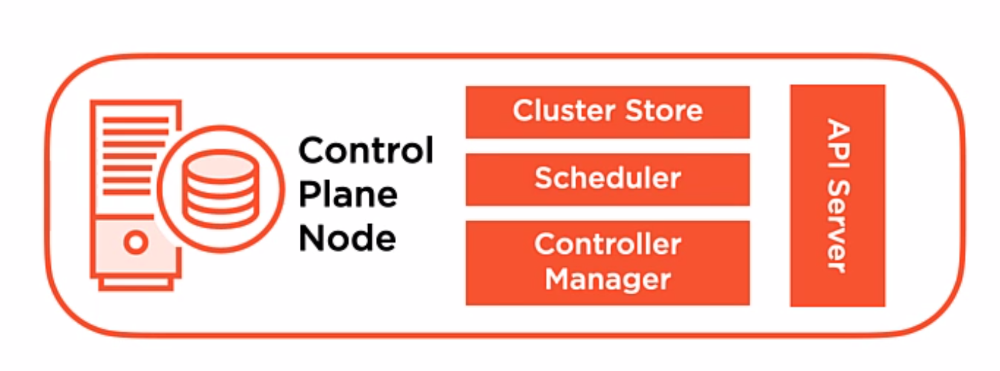

# Overview
- Working with kubernetes objects
    - Defining objects
    - API Groups
    - API Versioning
- Anatomy of an API Request

# The Kubernetes API and API server

The kubernetes API is a single surface area over the resources in your data center(kubernetes cluster). This surface area gives us the ability to use API objects to help model our system and build the workloads that we want to deploy in our cluster.

## API Objects

- The API objects are a collection of primitives to help us represent our system's state.
- We are able to define what the desired state is.
- Being able to define the state enables us to configure our system and model our system as API objects deployed in our API server
- The API enables us to be able to configure the state (Q: Through deployment.yml/service.yml?)

## API Server

- The API server is going to be the sole way that we interact with our cluster.
- The API server is also the sole way that kubernetes interaces with our cluster when it needs to exchange data between the various componets of the cluster itself.
- The API server is a client/server architecture.
- Implements RESTful API over HTTP using JSON
    - Basically will be exchanging JSON ojbects between client and server using the RESTful API.
    - HTTP requests: GET, SET, POST, UPDATE, etc
- The client will submit request over HTTP/HTTPS
- The server will respond to the requests
    - based on the actions the server took will be either success (20x) or failure (40x)
- THe API server is **stateless**; meaning it does not know or remember state, it just acts/responds.
    - Said another way, any configuration changes that we made in our cluster (via API ojbects) are not stored in the API server
    - Configuration changes are serialized and persisted in the cluster store; typically **etcd**

## Control Plane Node

Inside the control plane node we have a collection of critical services that help us facilitate cluster operations, the API server, cluster store (etcd), the scheduler and the controller manager. The API server is the primary access point to access and utilize these critical services(administer our cluster).



- Cluster store is where the state of the system is stored and persisted in a key value data store, etcd.
- Scheduler tells kubernetes which nodes to start pods on based on the pod's resource requirements in our workloads.
- Controller Manager has the job of implementing the lifecycle functions of controllers, keeps things in desired state.

Next we are going to look at the API server and its interactions with clients, like kubectl, and how they work together to create or make changes to resources deployed in our cluster with API objects.

## API Objects (deeper)

Kubernetes API ojbects are the persistent entities that allow us to build and deploy systems in kubernetes. They are the **things** that we'll use in our code to model our systems.

- We send that configuration to the API server
- The api sends the configuration to get persited in etcd
- Then the other core services get to work to have our desired state become the actual state
- The goal to have our API object match the desired configuration that is stored in etcd.
- API object are the things that represent the state of the system that we want to build.

### API Object Organization

API objects are organized in three ways:
1. API Kind - Pod, Service, Deployment (can look at these as REST resources/API objects?)
2. API Group - core, apps, storage
    - a way to organize/group like objects together based on their function
    - core - the essential API componets foundational to the kubernetes workloads
    - apps - API ojbects that are used to build and model applications in our clusters; deployments
    - storage - used to model storage inside our cluster
3. API Version - v1, beta, alpha
    - the version schema of the API object

#### API Objects Kind Grouping

- Pods - Used to deploy our container-based applications in kubernetes.
- Deployments - allow us to declaratively deploy applications in our cluster
    - Control our applictions in terms of the container image or version of our applications
    - Help us to scale our application as needed.
- Services - Provide persistent access point and load balancing for apps running on pods
- PersistentVolumes - Used to provide persistent storage to our container-based applications 

These are not a comprehensive list of API objects but these are the key players.

### Working with Kubernetes Objects

- Imperative configuration
    - use this for troubleshooting
- Declaritive configuration
    - define the desired state of our cluster, in code, using **manifests**
    - manifests can be in either YAML or JSON format
        - think of the manifests as you defining the API object and how you want that API object to work
    - `kubectl apply -f deployment.yaml`


# Building a Basic Manifest for a Pod

```yaml
apiVersion: v1
kind: Pod
metatata:
  name: nginx-pod
spec:
  containers:
  - name: nginx
    image: nginx
```

These 4 elements are required for any kubernetes manifest: **apiVersion, kind, metadata, and spec**

How do you find out which fieled or elements you need to fill in the spec part of the manifest? RTFM!
https://kubernetes.io/docs/reference/kubernetes-api

Also can use kubectl explain elements/fields that are available to use:

`kubectl explain pod.spec.containers | less`

## Working with `kubectl dry-run`

To make sure that our manifests are syntactically correct, and therefore able to be properly run, we can use the kubectl `dry-run` feature flag.

- Server-side - when making an API request that create or changes resources in my cluster add the `dry-run` flag
    - this allows the request to be processed by the API server but the request will not be persisted in storage;
    - therefore nothing in your cluster will change as a result.
    - this will let us test, without changing the cluster, if our manifest in properly formatted and is able to be processed 
    - if there is an issue, the API server will let me know; like if an object already exists or if there is a syntax error in the manifest.

- Client-side - writes the object to be created to **stdout** rather than the API server
    - useful to validate if a manifest is syntactically correct.
    - but since it is not sent to the api server, it could fail for a different reason.
    - use this to generate syntactically correct YAML manifests

- Imperative Combo 
    - can combine dry-run client with imperative commands like `kubectl create ..` for API objects like deployments, pods, and others. 
    - once you have the basic manifest, you can add to it to tweak it to your liking

### Examples:

- Server-side - `kubectl apply -f deployment.yaml --dry-run=server`
- Client-side - `kubectl apply -f deployment.yaml --dry-run=client`
- Imperative Combo - `kubectl create deployment nginx --image nginx --dry-run=client -o yaml`
- Imperative Combo - `kubectl create deployment nginx --image nginx --dry-run=client -o yaml > deployment.new.yaml`

## Working with `kubectl diff`


## API Server Discovery
`kubectl config get-conetexts`
`kubectl api-resources | less`
`kubectl explain pod`
`kubectl explain pod.spec.containers | less`

# Anatomy of an API Request

When we work at the command line with a tool like kubectl, and we enter a command, it will convert that request from yaml to json and submit the reqeust to the API server. Basically, since the kubernetes API is a RESTful http appliction, we just need to hit the API's url paths/endpoints with the proper json payload to administer our cluster. We will look at the API requests, API paths, and the repsonses sent back from the server to the client.

- Kubernetes API is a client/server architecture; clients submit requests to the server
- kubectl is a utility that simplifies the client requests
- any http client that can respect the http protocal can be used to submit requests
    - this allows you to build custom tools to interact with the kubernetes API
    - like `curl`; we can use curl to create our requests from scratch

### What does an API Request Look Like?

It will have the following elements:
- http verb like GET, POST, DELETE
- resource location (URL/path)
- repsonse from the server

### RESTful API Verbs

- GET    - get the data for a specified resource
- POST   - create a resource
- DELETE - delete a resource
- PUT    - create or update entire existing resource
- PATCH  - modifiy the specified fields of a resource

### Special API Requests

- LOG - retrieve logs from a container in a pod
- EXEC - execute a command in a container and get output
- WATCH - change notifcation on a resource with streaming output
    - this works by watching the version of the resouce and if that changes then watch displays that change?

### API Resource Location (API Paths)

- API paths are in two different buckets
    - core API group
        - http://apiserver:port/api/$version/$resource_type
        - http://apiserver:port/api/$version/namespaces/$namespace/$resource_type/$resource_name
    - named API groups
        - http://apiserver:port/apis/$groupname/$version/$resource_type
        - http://apiserver:port/apis/$groupname/$version/$namespace/$resource_type/$resource_name

### Response Codes from API Server

Success or failure codes returned, from the API server, depending on the format/syntax of the client request.

- Success (2xx)
    - 200 - OK
    - 201 - Created (put verb)
    - 202 - Accepted - meaning successful request received and now we (server) are working on it
- Client Errors (4xx)
    - 401 - Unautorized - I don't know you. You did not authenticate or failed authentication.
    - 403 - Access Denied - I know you but you do not have the permissions/authority to do this action
    - 404 - Not Found - I did not find what you were looking for to perform an action, check your request text
- Server Errors (5xx)
    - 500 - Internal Server Error - something is off with me, not you.

### Steps of an API Request

1. Client Request
2. Connection
    - Can we make a connection to the API server?
    - HTTP over TCP
    - TLS Encrypted (HTTPS)
    - Some kind of bad protocol if this step fails(?)
    - Bad connection setting if this step fails(?)
3. Authentication
    - logging in; are you a registered user?
    - authentication plugin
    - modular
        - certificates
        - passwords
        - tokens
    - 401 response if this step fails
4. Authorization
    - can the user get this info -or- perform this action?
    - can the user use the API HTTP verb on the API object/resource/url endpoint?
    - actions in kubernetes are denied by default
        - roles are created and users are put into that role to be able to be authorized
    - 403 error if this step fails
5. Admission Control
    - gives us administrative control over an API request with an admission controller
    - it is additional code that intercepts requests to the API server prior to persisting that object to the cluster store
    - when an object is being created, deleted, or updated, the request is passed through the admission controller which can modify or reject the request
    - this give admins lots of flexibility with the particulars of kubernetes API server
    - some examples are; adding default values, overriding object values, asserting resource quotas
    - validation happens when the object being requested is validated using the validation routines for the objects we want to work with.
        - said another way, is this request in the proper form for this object
6. Server Response

Note that all these steps happen prior to our request being stored in the cluster store, `etcd`


