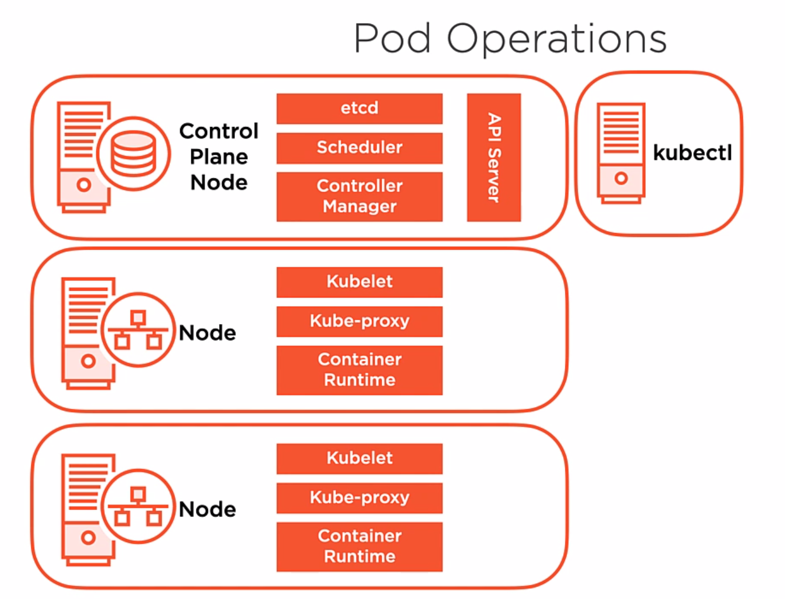

## Storage 10%

- Understand storage classes, persistent volumes
- Understand volume mode, access modes and reclaim policies for volumes
- Understand persistent volume claims primitive
- Know how to configure applications with persistent storage

## Troubleshooting 30%

- Evaluate cluster and node logging
- Understand how to monitor applications
- Manage container stdout & stderr logs
- Troubleshoot application failure
- Troubleshoot cluster component failure
- Troubleshoot networking

## Workloads & Scheduling 15%

- Understand deployments and how to perform rolling update and rollbacks
- Use ConfigMaps and Secrets to configure applications
- Know how to scale applications
- Understand the primitives used to create robust, self-healing, application deployments
- Understand how resource limits can affect Pod scheduling
- Awareness of manifest management and common templating tools

## Cluster Architecture, Installation & Configuration 25%

- Manage role based access control (RBAC)
- Use Kubeadm to install a basic cluster
- Manage a highly-available Kubernetes cluster
- Provision underlying infrastructure to deploy a Kubernetes cluster
- Perform a version upgrade on a Kubernetes cluster using Kubeadm
- Implement etcd backup and restore

## Services & Networking 20%

- Understand host networking configuration on the cluster nodes
- Understand connectivity between Pods
- Understand ClusterIP, NodePort, LoadBalancer service types and endpoints
- Know how to use Ingress controllers and Ingress resources
- Know how to configure and use CoreDNS
- Choose an appropriate container network interface plugin

---
# Basic Principals of Kuberntes

## What is Kubernetes?
It is a container orchestrator - give analogy
  - workload placement
    how are things deployed
  - provide infrastructure abstraction - takes away managing bits of infra
  - desired state - defined in plain text; yaml?

## What are benefits of Kubernetes?
- speed of deployment
- ability to absorb change quickly
- ability to recover quickly (looks at desired state all the time)
- hide complexity in the cluster - storage, VMs(workload placement), networking

## What are some basic operating principals in K8s?
Desired State / Declaritave Configuration
- define our desired application's state in code/plain text and k8s will keep checking to make sure it is so
- pulls containers, set up loadbalancers, assign ips, etc

## Controllers / Control Loops
- Has the responsibility of constantly monitoring the running state of the system to make sure that the system is in the desired state. If not, the controller will attempt to bring the system into its desired state.
- There are different kinds of controllers in k8s.

## K8s API Server
- Provides a collection of objects that we can use to build and define the systems that want deployed in code. The objects defined in our code define the desired states of our application
- Implemented and made available by the API server.
- API server is the main communication hub of information; this is how we deploy and interact with a cluster
- Clusters interact with each other through the API server

## What is the k8s API made of?
- API Objects - collection of primitives to represent my system's state
  - things like pods (that contain containers)
  - or nodes (which represent VMs)

## What can we do with these API Objects?
- We are able to configure the state of the system declaratively and imperatively
  - declare/describe - the system fills in the gaps and makes it so.
  - imperative/commands - you tell the system how you want it done.

##  How does the API server communicate with everything?
- It uses a RESTful API, over HTTP, using JSON.
- This is the communication an admin uses as well as the system uses between clusters.
- When we communicate with the API server, to create and/or change objects, this information is serialized(JSON?) and persisted into the cluster data store.

## What are the core, primitive API objects in k8s?
- These are our building blocks for our deployments inside of k8s. 
- Pods: A single or a collection of containers to deploy as a single unit.
- Controllers: These keep our system in the desired state; ie Replica Sets, Deployments (core tools to know and use)
- Services: These provide a persistent access point to the applications we deploy in pods
  - as things change, (like pods going up and down due to controllers) it is important to not loose connections and services facilitate this persistence.
- Storage: We'll, for sure, need to store our data. K8s gives us storage objects for persistent data.
- This is not an exhaustive list but is a great starting point to be able to grasp the glory that is k8s.

## What can you tell me about the primitive Pod API object?
- A pod is a construct that represents one or more containers inside a k8s cluster.
- container based application or service that I want to deploy
- A pod is the most basic unit of work in k8s. It is the unit of scheduling?
- When you define a pod, you can also define the resources it requires inside the manifest? that describes our deployment.
- K8s ensures the resources are available and then schedules the pod to be deployed in the cluster.
- Pods are ephermeral - no pod is ever redeployed meaning, no state is shared between an old pod and a new one that takes it place.
- Pods have atomicity - they are either there, or they are not there. They either work or do not and there is no in-between.
- K8s keeps your pods up and running using controllers; remember controllers work to keep your system in the desired state you define somewhere?
- K8s keeps track of the **STATE** of your atomic pod. Is the pod up and running? / Are the containers in your pod up and running?
- What happens if your containers inside a pod are up and running but are throwing errors?
  - K8s keeps track of the **HEALTH** of your pod asking, "Is the container throwing errors?".
  - How does k8s track the health of a container in your pod?
     - It uses **PROBES**
     - You can define probes to check the health of an application in our deployment code? What does deployment code look like / consist of?
     - You can write a probe that checks a url and tests if an appropriate response is given.
     - If a probe fails, k8s will get to work to make the probe correct. Most likey remove and replace the pod but that is not all k8s can do.

## What can you tell me about the primitive Controller API object?
- K8s uses controllers to manage your pods' state. Controllers check that your pod is up, running, and healthy.
- Controllers respond to pod state and health.
- Controllers defines your desired state and also ensures things stay in the desired state.
- Controllers are exposed to me as a workload resource API object that can create and manage pods for me.
- These API objects will create and configure the controllers and will create and manage my pods.
- One type of controller is a `ReplicaSet`:
    - What is a `ReplicaSet`?
    - A replicaset allows us to define the number of replicas for a particular Pod
    - We generally do not create ReplicaSets; we use `Deployments`; said another way, you can define the replica sets in the deployment.
- What does a deployment do then?
    - The deployment controller manages the transition between two replicasets
    - As an example, think of when a new version of your service is deployed, you have the v1.1 pods and you replace them with v1.2 pods.
    - You can even roll back to previous version if you need to.
- Deployments are core to the success of deploying applications in Kubernetes.

## How does k8s add persitenacy/consistency to all this ephemerality(contant change)? ---> **Services**
- **Services** are the thing that adds persitance between all the changes that controllers make.
    - Hey that's cool. How does a service accomplish this?
    - Service objects are a network abstraction to provide access to the container services that pods acutally provide. It does this by persitently allocating an IP and DNS name for the application services that are provided by the collection of pods that we want to front-end with a service.
    - As pods come and go based on their desired state, under the hood, k8s is going to dynamically update the service with new infromation for those particular pods. (Seems this new information is how to reach the service after accessing the front-end ip/dns.)
    - Our users or other application that need to communicate with a pod service, will simply access that front-end IP address or DNS name and k8s will maintain the infrastructure(networking?) as pods come and go based on their lifecycle and/or desired state.
    - This is the answer, k8s will update **internal routing** information to pods as they come and go. But there is a persitant front-end ip/dns.
- We can also use services to scale up or down the number of pods running based on the demands of that application.
- Services also can provide load balancing ito distribute application load across the pods providing that application service.

## What about data? How is data stored with all this ephemerality?
- Volume - physical media directly accessable to a pod; defined in a deployment. Inflexable.
- Persistent Volume - pod indepentant storage defined, by an administrator, at the cluster level.
    - Persistent Valume Claim - how a pod gets access to a persistent volume; this is in the pod definition
    - This makes deploying pods more flexible than just a regular volume.

---

# Kubernetes Cluster Architecture
## Cluster Components
### Control Plane Node
The control plan node implements the major control function of a cluster.
- It coordiates cluster operations, monitoring, pod scheduleing and is the primary access point for cluster information.
- Note: control plane nodes used to be called master nodes 

### Node/Worker Node
This is where our application pods run.
- Has the reponsiblity to start pods and the containers within the pods.
- Node implement networking and ensure network reachablity to the pods and services running on worker nodes.
- Each node in a cluster contributes to the compute capacity of the cluster, and clusters are generally compose of mutliple nodes based on the scalabitly requirements of the workloads deployed.
- Nodes can be either virtual or physical machines

### Tell me more about the control plane node...
The control plane node (which implements the major control functions of a cluster) is made up of several components.
1. API Server
    - The primary access point for cluster and administrative operations
    - Essentially the communications hub of the k8s cluster
    - The API server is stateless so we need a place to store the state of the system. The cluster store called `etcd` is where the state is stored.
2. etcd
    - This has the responsiblity of persiting the state of your k8s objects
3. Scheduler
    - This tell k8s which nodes to start pods on based on the pod's resource requirements and other attributes like administrative policies.
4. Controller Manager
    - This has the job of implementing the lifecycle function of the controllers that execute an monitor the state of k8s objects like pods.
    - As mentioned before, this has the responsibility to keep things in the desired state.
5. `kubectl`
    - While not a component of the control plane node, it is important to us because this is how we, as an admin, interact with and get data from the control node.
    - It interacts with the API server
    - It is our primary administrative  commandline tool for operating our cluster.

### Tell me more about the control plane components...
#### API Server
- This is central to the control of my cluster; all config changes pass through here
- It leverages a simple RESTful API exposing operations like GET, PUSH, POST, etc.
- The API server validates operations that go into it and to persist that object state into the cluster data store... etcd
- Updates etcd
#### etcd
- This is the cluster datastore and its job is the persit the state of the objects as key value pairs.
#### Scheduler
- The scheduler watches the API server for unscheduled pods, and then schedule those pods on nodes.
- When scheduling pods the scheduler will evaluate the resources required by the pod (CPU, memory, storage) to ensure their availability when placing the pod into the cluster.
- The scheduler has the responsiblity of respecting any constraints that we defined administratively. Pod affinity or pod anti-affinity
- There are many other attiributes the scheduler will use.
#### Controller Manager
- It is the job of the controller manager to execute those controller loops.
- Controller loops implement the lifecycle function of pods and thus defined the desired state of the system
- The controller manager also watches the current state of the system and update the API server to ensure that it is heading towards the desired state.
- A replicaset is a controller api object, this ensure that the correct number of pods or replicas are up and running in our deployments.
    - the replicaset controller will take on the responsiblity to communicate the API server changes in its desired state.
    - for example creating new pods or deleting old pods based on the running state of the cluster.

### Tell me more about worker nodes and their components...
A node is where our application pods run.
- The node starts up the pods and ensures that the containers in those pods are up and running.
- Nodes also implement networking to enxure the reachability of the pods running on the nodes in our cluster.
- You can have many nodes in your cluster based on the scalability requirements of the application that we're deploying inside of k8s. 
- Nodes can exist as either physical or virtual machines.
#### Kubelet
- The kubelet has the responsibiliy for starting up the pods on the node.
- It constantly asks the API server if there is any work for it do to.
- If no, the kubelet will ask again. If yes, the kubelet with start/stop a pod at the control plane nodes directions.
- The kubelet will also report on the state of the node and the state of the pod.
    - This means that if a node in reachable and its status is ready then it is avialable for scheduling of new pods in our cluster.
- Is the pod up and running? Pod state is reported back to the API server
- The kubelet will also execute probe for the health of a pod.
#### Kube-proxy
- The kube-proxy has the responsibility for pod networking and implementing our services abstration on the node itself
- Common usage of kube-proxy is `iptables`
- Responsible for routing traffic to pods.
    - As application requests arrive at a node's door, it is kube-proxy's job to get the request to the correct node/(pod?) in the cluster.
- Kube-proxy is also used for load balancing. Makes sure that network traffic coming in is evenly distrubuted.
#### Container Runtime
- This is the acutal runtime environment for our containers.
- This has the responsibility of pulling the container image for the container registrey and providing an execution environment for the container image and the "pod abstration".?
-  The container runtime is wrapped up in what is known as the Container Runtime Interface (CRI)
    - This allows us flexiblity to swap out the container runtime for any of our choosing. (Linux, MacOS, Windows?)
- We will use `containerd` as our CRI.

The kubelet and kube-proxy both communicate directly with the API server, monitoring it for changes to the environment.
#### kubelet example operation
- As pods are scheduled to an individual node, the kubelet will montitor the API server for that information.
- If it detects an incoming, scheduled pod, it will start up the containers needed to support that pod in the node.
#### kube-proxy example operation
- If there is a networking topology change that needs to be implemented, like adding a newly-create pod's IP to a service for load balancing, it is the responsiblity of the kube-proxy to pick up that change from the control plane's API server, and make that modification on the node.

Note that all these worker node components (kubelet, kube-proxy, container runtime) will run on all the nodes in the cluster; even the control plane nodes.

### What is a `Cluster Add-on Pod`?
Cluster add-on pods are pods that provide special services to the cluster itself. You can think of them as special-purpose pods. For example, you can use a special-purpose pod for DNS.
- A pod that provides DNS services in the cluster using the CoreDNS DNS server.
- The IPs for the k8s service front ending these DNS server pods and the search suffix domain is placed into the networking configuration of any pods created by the clusters API server.
- Pods, nodes, and services will register their addresses with the DNS server when they are created.
- Since this is the DNS server used inside of the cluster for its services, it is commonly used for service discovery for applications deployed inside of a cluster.
- Most likey to always find a DNS special-purpose pod in every cluster.
- Other cluster add-ons include:
  - Ingress Controllers - http load balancers and content routers
  - K8s Dashboard - web based GUI to administer your k8s cluster. kubectl is the CLI tool to administer your cluster.
  - Network Overlays - Calico?

### Pod Operations - take a look at k8s in action.
- We have one control plane node and two worker nodes.

    

- Using kubectl we submit code to instruct k8s to create a deployment.
- In our deployment we've defined that we want three replicas of our pod.
